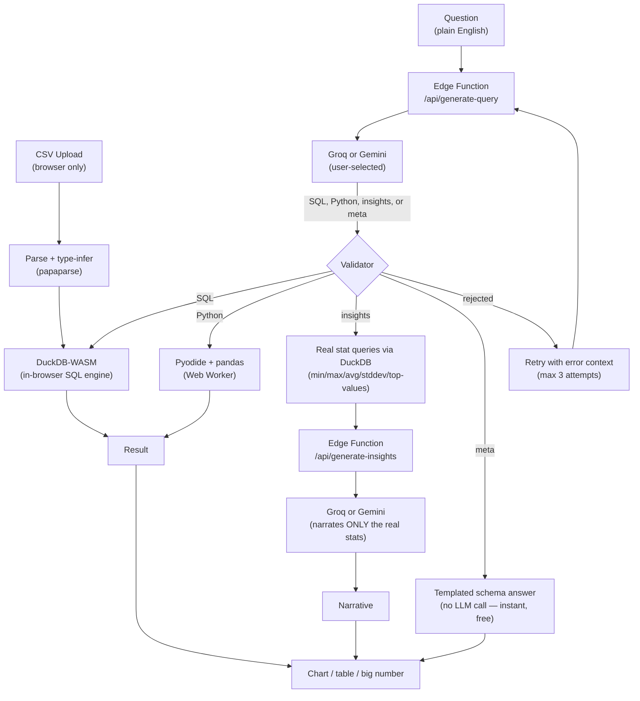

# AI Data Analyst Agent

[](https://github.com/Zephyrex21/ai-data-analyst-agent/actions/workflows/ci.yml)


> Badge repo path assumes `Zephyrex21/ai-data-analyst-agent` — update if the actual GitHub repo name differs.

Upload a CSV, ask questions about it in plain English, get a real, verified, executed answer back — not a guess. **[Try it live →](https://ai-data-analyst-agent-one.vercel.app/)** (loads a sample dataset with one click, no upload required).

**Data privacy, in one line:** your CSV never leaves your browser — DuckDB and Python both run client-side; the only thing that touches a server is the plain-text question itself, sent to whichever model provider (Groq or Gemini) you've selected to generate query code (never your data).

## The problem this solves

Most "AI + your data" demos are LLM chat wrappers: the model reads a sample of your rows and generates plausible-sounding prose. It's confident, and it's frequently wrong — there's no execution, no verification, nothing stopping it from inventing a number that looks right.

This project takes a different approach: the LLM never gets to just answer directly. For anything computable, it writes **SQL or Python**, that code gets **validated** against the real schema and a safety layer, then it's **actually executed** against the real data, and the real result is what gets shown. If the code is unsafe, hallucinates a column, or fails to run, the system **retries with the error fed back to the model** — up to 3 attempts — before giving up honestly. For genuinely open-ended questions ("summarize this dataset," "what stands out") there's an **insights engine** that runs a single batched DuckDB query for every column's real min/max/avg/stddev plus pairwise correlations between numeric columns (scoped to just the columns the question actually names, when it names any), then has the model narrate *only* those real numbers — structurally unable to invent a figure, same guarantee as SQL/Python, just phrased in prose. For questions about the dataset's *structure* rather than its values ("what columns do you have," "what can I ask you") there's a fourth **meta engine** that needs no LLM call at all — it's answered directly, instantly, and for free from schema facts already known client-side. And if a question isn't about the dataset at all, the router says so honestly instead of chatting — that decline is deliberately worded differently from "this metric doesn't exist," so the two failure modes never look the same. Every answer shows a badge for which engine and which model provider produced it, and toggling **Dev Mode** reveals the exact generated code behind any SQL/Python answer.

## Architecture


```mermaid
flowchart TD
    U["CSV Upload<br/>(browser only)"] --> P["Parse + type-infer<br/>(papaparse)"]
    P --> D["DuckDB-WASM<br/>(in-browser SQL engine)"]

    Q["Question<br/>(plain English)"] --> E["Edge Function<br/>/api/generate-query"]
    E --> G["Groq or Gemini<br/>(user-selected)"]
    G -->|"SQL, Python, insights, or meta"| V{"Validator"}

    V -->|"SQL"| D
    V -->|"Python"| PY["Pyodide + pandas<br/>(Web Worker)"]
    V -->|"insights"| STAT["Real stat queries via DuckDB<br/>(min/max/avg/stddev/top-values)"]
    V -->|"meta"| META["Templated schema answer<br/>(no LLM call — instant, free)"]
    V -->|"rejected"| R["Retry with error context<br/>(max 3 attempts)"]
    R --> E

    STAT --> NAR["Edge Function<br/>/api/generate-insights"]
    NAR --> G2["Groq or Gemini<br/>(narrates ONLY the real stats)"]
    G2 --> NARR["Narrative"]

    D --> RES["Result"]
    PY --> RES
    RES --> C["Chart / table / big number"]
    NARR --> C
    META --> C
```

Everything except the LLM calls runs **entirely in your browser** — DuckDB-WASM for SQL and for the insights engine's stat queries, Pyodide (in a Web Worker, so it never freezes the UI) for statistical Python. The only server-side code is two small serverless functions that proxy whichever model provider is selected, so no API key ever reaches the client. The insights engine specifically never lets the model invent a number — it only ever narrates figures a real DuckDB query already computed.

## Screenshots

| | |
|---|---|
|  Homepage |  SQL answer, chart + code shown |

*(See `demo-script.md` for the full shot list.)*

## Why these specific choices

| Choice | Why |
|---|---|
| DuckDB-WASM over a backend DB | Zero server cost, zero server security surface — nothing executes anywhere but the user's own browser |
| Pyodide in a **Web Worker**, warmed up in the background right after upload | Running Python/pandas on the main thread would freeze the UI during the ~10-20s first load; the worker keeps the page responsive, and starting that download immediately after upload (Phase 25) means it's often already done by the time a question actually needs it — skipped automatically if the browser signals data-saver mode |
| Groq (`openai/gpt-oss-120b`) + Gemini (`gemini-2.5-flash`), user-selectable | Both have workable free tiers; letting the person pick means one provider's rate limit or an outage doesn't take the whole demo down |
| Validation layer, not just prompting | An LLM will occasionally write `MAX revenue` instead of `MAX(revenue)`, or invent a `profit_margin` column that doesn't exist. Prompting reduces this; a real validator catches what prompting misses |
| Self-correction loop | When validation or execution fails, the exact error is fed back to the model for a fix — turns "rejected" into "usually just works" |
| Vitest + CI | 118 tests, including mocked integration tests of the retry loop itself (not just the validators) and CSV edge cases (BOM, encodings, delimiters, line endings, size caps) — CI runs on every push |

## Local development

This project has a Vercel serverless function (`/api/generate-query.ts`), so plain `npm run dev` will run the frontend but the API route won't work — use the Vercel CLI:

```
npm install -g vercel
npm install
cp .env.local.example .env.local   # then paste your real key(s) into .env.local
vercel dev
```

Get a free Groq API key (no card required) at https://console.groq.com. The Gemini option is optional — get a free key at https://aistudio.google.com/apikey and add `GEMINI_API_KEY` too if you want it; without it, the Gemini option in the selector will just return a clear "missing key" error instead of breaking anything else.

## Testing

```
npm test          # run once
npm run test:watch
```

118 tests: CSV parsing (including edge cases — BOM, non-UTF-8 encodings, delimiters, line endings, size caps), the SQL/Python validators, chart-type selection, conversation-history summarization, a sanity check on the bundled sample dataset, the Groq/Gemini provider abstraction (mocked fetch — no real API calls or keys needed), and integration tests of the generate→validate→execute→retry orchestration loop (mocked LLM/execution, no network needed). CI (`.github/workflows/ci.yml`) runs the full suite plus a production build on every push and pull request to `main`.

There's also a separate, non-CI eval suite (`npm run eval`) that hits the real LLM against 18 questions to catch prompt regressions — see `eval-set.md` for why it's deliberately kept out of CI.

## Deploying

Push to GitHub, import the repo in Vercel, then add `GROQ_API_KEY` (and optionally `GEMINI_API_KEY`) under Project Settings → Environment Variables and redeploy.

## Feature overview

- Drag-and-drop CSV upload with client-side type inference, malformed-row handling, and a one-click bundled sample dataset (1,440 rows, 90 days, 4 regions/products) for zero-setup demos
- Natural language → SQL (DuckDB-WASM), Python (Pyodide/pandas), a narrated "insights" answer over real precomputed stats, or a "meta" answer about the dataset's structure/capabilities — router picks per question
- Off-topic questions get a distinct, honest decline from "on-topic but this metric doesn't exist" — the app never pretends to be a general chatbot
- Dev Mode toggle — reveals the exact generated SQL/Python behind each answer
- Switchable model provider (Groq or Gemini) via a selector — the choice is remembered and shown per-answer
- Charts auto-selected by result shape (pie/bar/line/big-number), tables always available as ground truth
- Safety validator: blocks non-SELECT statements, unknown tables/columns, unsafe Python patterns; caps result size
- Self-correcting retry loop (max 3 attempts) with full error context fed back to the model
- Multi-turn conversation memory — follow-up questions like "now break that down by region" work
- Fully client-side execution; only the LLM call touches a server

## Known limitations / not implemented

- Single flat table only — no joins, no multi-file uploads. Multi-statement CTEs (`WITH ... AS (...)`) aren't supported either, but single-level subqueries and window functions are (e.g. "top N per group" via `ROW_NUMBER() OVER (PARTITION BY ...)`) — see `sqlValidator.ts` for exactly what's allowed
- The SQL/Python validators are heuristic, not full parsers — they catch destructive statements and hallucinated columns, not every possible malformed query (that's what the retry loop is for)
- No auth/persistence — this is a stateless, single-session tool by design

## More

- [`ENGINEERING_JOURNAL.md`](./ENGINEERING_JOURNAL.md) — five real bugs found and fixed during this build, and what each one actually taught
- [`demo-script.md`](./demo-script.md) — a ~60-90s shot list for a demo video
- [`eval-set.md`](./eval-set.md) — how the prompt itself gets regression-tested
