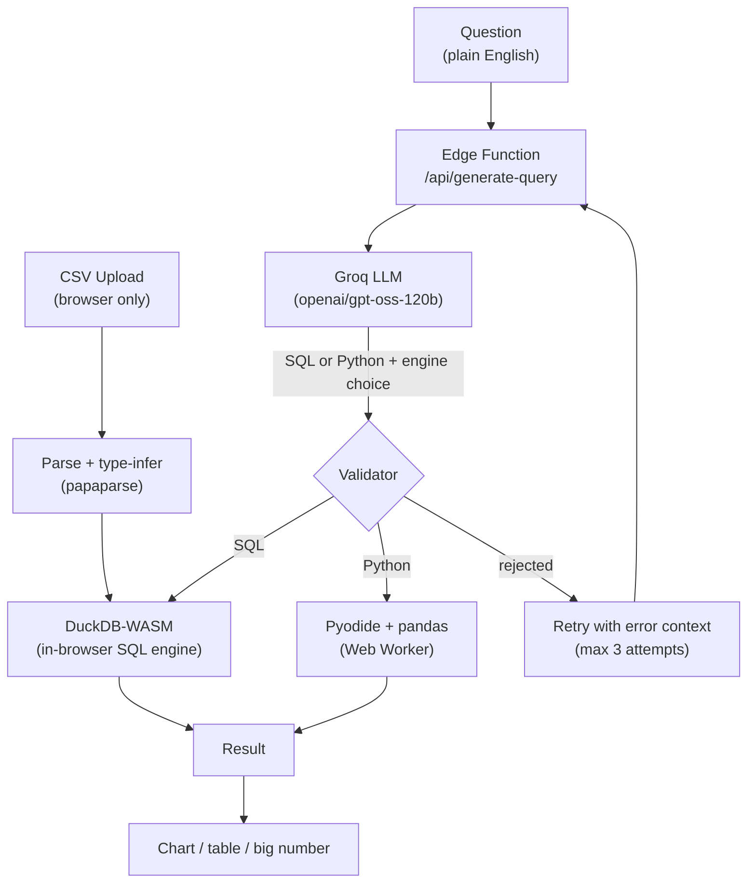
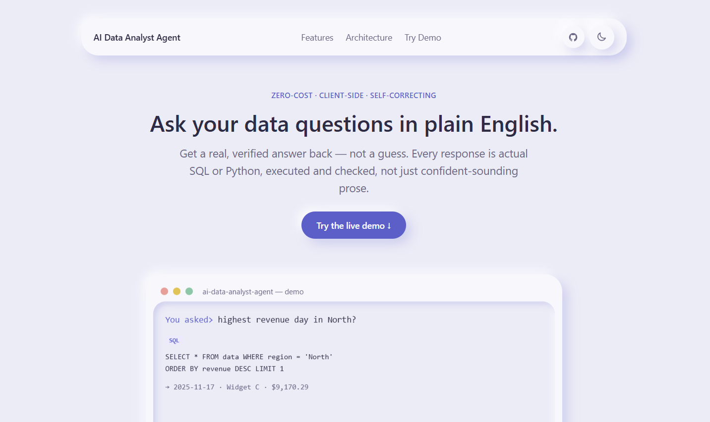
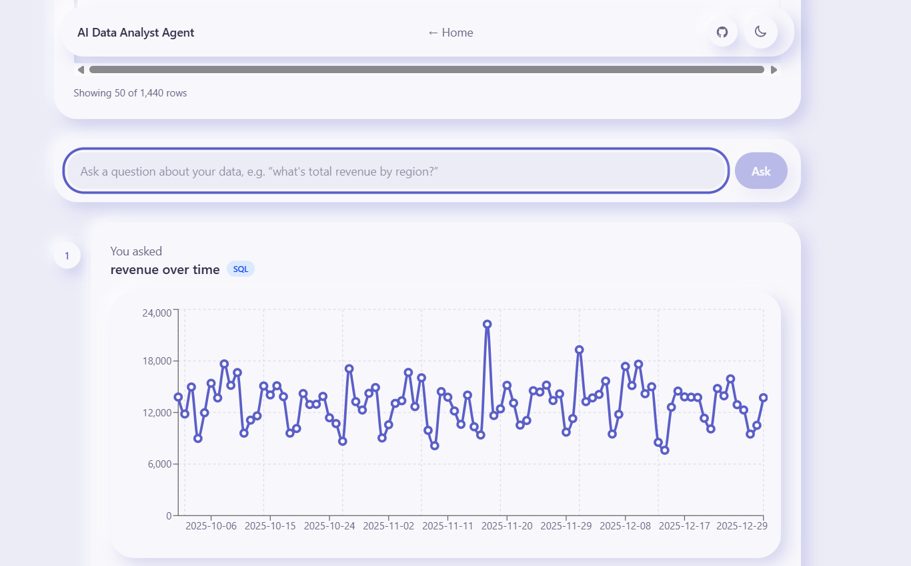

# AI Data Analyst Agent

[](https://github.com/Zephyrex21/ai-data-analyst-agent/actions/workflows/ci.yml)


> Badge repo path assumes `Zephyrex21/ai-data-analyst-agent` — update if the actual GitHub repo name differs.

Upload a CSV, ask questions about it in plain English, get a real, verified, executed answer back — not a guess. **[Try it live →](https://ai-data-analyst-agent-one.vercel.app/)** (loads a sample dataset with one click, no upload required).

**Data privacy, in one line:** your CSV never leaves your browser — DuckDB and Python both run client-side; the only thing that touches a server is the plain-text question itself, sent to Groq's API to generate query code (never your data).

## The problem this solves

Most "AI + your data" demos are LLM chat wrappers: the model reads a sample of your rows and generates plausible-sounding prose. It's confident, and it's frequently wrong — there's no execution, no verification, nothing stopping it from inventing a number that looks right.

This project takes a different approach: the LLM never answers directly. It writes **SQL or Python**, that code gets **validated** against the real schema and a safety layer, then it's **actually executed** against the real data, and the real result is what gets shown. If the code is unsafe, hallucinates a column, or fails to run, the system **retries with the error fed back to the model** — up to 3 attempts — before giving up honestly. Every answer has a "show the code" option, and a small badge showing whether SQL or Python answered it.

## Architecture


```mermaid
flowchart TD
    U["CSV Upload<br/>(browser only)"] --> P["Parse + type-infer<br/>(papaparse)"]
    P --> D["DuckDB-WASM<br/>(in-browser SQL engine)"]

    Q["Question<br/>(plain English)"] --> E["Edge Function<br/>/api/generate-query"]
    E --> G["Groq LLM<br/>(openai/gpt-oss-120b)"]
    G -->|"SQL or Python + engine choice"| V{"Validator"}

    V -->|"SQL"| D
    V -->|"Python"| PY["Pyodide + pandas<br/>(Web Worker)"]
    V -->|"rejected"| R["Retry with error context<br/>(max 3 attempts)"]
    R --> E

    D --> RES["Result"]
    PY --> RES
    RES --> C["Chart / table / big number"]
```

Everything except the LLM call runs **entirely in your browser** — DuckDB-WASM for SQL, Pyodide (in a Web Worker, so it never freezes the UI) for statistical Python. The only server-side code is a small serverless function that proxies the Groq API call so the key never reaches the client.

## Screenshots

| | |
|---|---|
|  Homepage |  SQL answer, chart + code shown |
|  Python-answered question |  Honest decline (no fabricated number) |
|  Dark mode | |

*(See `demo-script.md` for the full shot list these are drawn from.)*

## Why these specific choices

| Choice | Why |
|---|---|
| DuckDB-WASM over a backend DB | Zero server cost, zero server security surface — nothing executes anywhere but the user's own browser |
| Pyodide in a **Web Worker** | Running Python/pandas on the main thread would freeze the UI during the ~10-20s first load; the worker keeps the page responsive |
| Groq (`openai/gpt-oss-120b`) | Free tier, fast enough that "AI thinking" doesn't feel like a loading screen |
| Validation layer, not just prompting | An LLM will occasionally write `MAX revenue` instead of `MAX(revenue)`, or invent a `profit_margin` column that doesn't exist. Prompting reduces this; a real validator catches what prompting misses |
| Self-correction loop | When validation or execution fails, the exact error is fed back to the model for a fix — turns "rejected" into "usually just works" |
| Vitest + CI | 72 tests, including mocked integration tests of the retry loop itself (not just the validators) and CSV edge cases (BOM, encodings, delimiters, line endings, size caps) — CI runs on every push |

## Local development

This project has a Vercel serverless function (`/api/generate-query.ts`), so plain `npm run dev` will run the frontend but the API route won't work — use the Vercel CLI:

```
npm install -g vercel
npm install
cp .env.local.example .env.local   # then paste your real Groq key into .env.local
vercel dev
```

Get a free Groq API key (no card required) at https://console.groq.com.

## Testing

```
npm test          # run once
npm run test:watch
```

72 tests: CSV parsing (including edge cases — BOM, non-UTF-8 encodings, delimiters, line endings, size caps), the SQL/Python validators, chart-type selection, conversation-history summarization, a sanity check on the bundled sample dataset, and integration tests of the generate→validate→execute→retry orchestration loop (mocked LLM/execution, no network needed). CI (`.github/workflows/ci.yml`) runs the full suite plus a production build on every push and pull request to `main`.

There's also a separate, non-CI eval suite (`npm run eval`) that hits the real LLM against 18 questions to catch prompt regressions — see `eval-set.md` for why it's deliberately kept out of CI.

## Deploying

Push to GitHub, import the repo in Vercel, then add `GROQ_API_KEY` under Project Settings → Environment Variables and redeploy.

## Feature overview

- Drag-and-drop CSV upload with client-side type inference, malformed-row handling, and a one-click bundled sample dataset (1,440 rows, 90 days, 4 regions/products) for zero-setup demos
- Natural language → SQL (DuckDB-WASM) or Python (Pyodide/pandas), router picks the engine per question
- Charts auto-selected by result shape (pie/bar/line/big-number), tables always available as ground truth
- Safety validator: blocks non-SELECT statements, unknown tables/columns, unsafe Python patterns; caps result size
- Self-correcting retry loop (max 3 attempts) with full error context fed back to the model
- Multi-turn conversation memory — follow-up questions like "now break that down by region" work
- Fully client-side execution; only the LLM call touches a server

## Known limitations / not implemented

- Single flat table only — no joins, no multi-file uploads, no CTEs (a deliberate scope decision, documented in `sqlValidator.ts`)
- The SQL/Python validators are heuristic, not full parsers — they catch destructive statements and hallucinated columns, not every possible malformed query (that's what the retry loop is for)
- No auth/persistence — this is a stateless, single-session tool by design

## More

- [`ENGINEERING_JOURNAL.md`](./ENGINEERING_JOURNAL.md) — five real bugs found and fixed during this build, and what each one actually taught
- [`demo-script.md`](./demo-script.md) — a ~60-90s shot list for a demo video
- [`eval-set.md`](./eval-set.md) — how the prompt itself gets regression-tested
